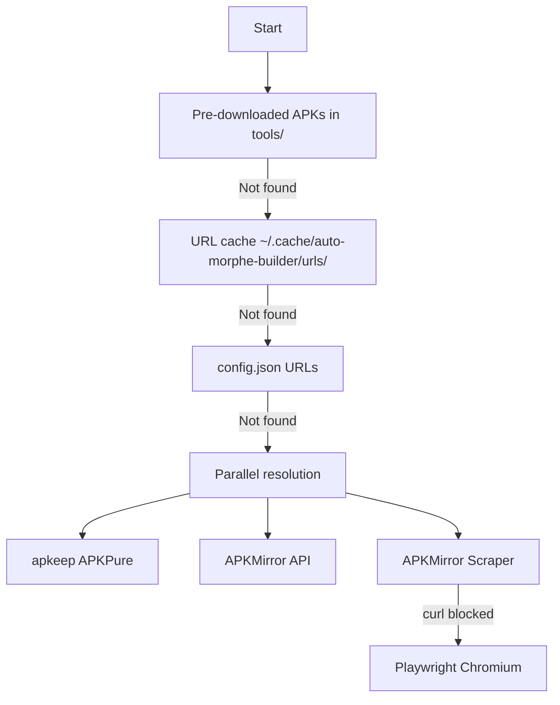

# AutoMorpheBuilder

> ⚠️ **Status**: Vibecoded & Work in Progress | Expect bugs, breaking changes, and incomplete docs

**Automated GitHub Actions pipeline** for building patched Android APKs using [Morphe patches](https://github.com/MorpheApp/morphe-patches), [morphe-cli](https://github.com/MorpheApp/morphe-cli), and [APKEditor](https://github.com/REAndroid/APKEditor).

🌟 **Forking this repo and patching apps for personal use is encouraged!** Feel free to customize the workflow, add more apps, or modify patches to suit your needs.

---

## 📱 Supported Apps

| App | Package ID |
|-----|------------|
| YouTube | `com.google.android.youtube` |
| YouTube Music | `com.google.android.apps.youtube.music` |
| Reddit | `com.reddit.frontpage` |

---

## 🔧 What It Does

1. ✅ Checks latest Morphe patch/CLI releases
2. ✅ Skips build if versions unchanged
3. ✅ **Auto-resolves latest supported app versions** from morphe-cli
4. ✅ Downloads APKs from APKMirror (with fallbacks)
5. ✅ Extracts/selects patchable APK (prefers configured arch, rejects dex-less splits)
6. ✅ Enforces signing (signed or fail)
7. ✅ Runs `morphe-cli` with your `patches.json` config
8. ✅ Publishes artifacts & creates GitHub Releases
9. ✅ Updates `state.json` & syncs `patches.json` with upstream

---

## 📦 Releases & Obtainium

### Release Format
Each app gets its own GitHub Release:
```
<app>-v<base-version>-<patches-version>
```

**Examples:**
- `youtube v20.44.38-v1.24.0-dev.8`
- `ytmusic v8.44.54-v1.24.0-dev.8`
- `reddit v2025.02.17-v1.24.0-dev.8`

### Obtainium Setup
Create **one entry per app** with these settings:

| Setting | Value |
|---------|-------|
| Source | GitHub |
| Repository | `nxn94/AutoMorpheBuilder` |

**Filters per app:**

| App | Release Tag Filter |
|-----|-------------------|
| YouTube | `^youtube` |
| YouTube Music | `^ytmusic` |
| Reddit | `^reddit` |

---

## 🔐 Required Secrets

Signed builds are **enforced**. Missing required secrets = build fails.

| Secret | Required | Description |
|--------|----------|-------------|
| `KEYSTORE_BASE64` | ✅ Yes | Base64 of your keystore file |
| `KEYSTORE_PASSWORD` | ✅ Yes | Keystore password |
| `KEY_ALIAS` | ❌ No | If empty, uses first alias in keystore |
| `KEY_PASSWORD` | ❌ No | Only if key password ≠ keystore password |
| `APKMIRROR_API_USER` | ❌ No | APKMirror-API username (pair with `_PASS`) |
| `APKMIRROR_API_PASS` | ❌ No | APKMirror-API password |

> 💡 **Tip**: APKMirror-API credentials speed up APK resolution significantly.

---

## ⚙️ Configuration

### `config.json` - Build Settings

```json
{
  "preferred_arch": "arm64-v8a",
  "auto_update_urls": true,
  "patch_repos": {
    "com.google.android.youtube": {
      "name": "youtube",
      "repo": "MorpheApp/morphe-patches",
      "branch": "main",
      "apkmirror_path": "google-inc/youtube"
    }
  },
  "cli": {
    "repo": "MorpheApp/morphe-cli",
    "branch": "main"
  }
}
```

| Setting | Default | Description |
|---------|---------|-------------|
| `preferred_arch` | `arm64-v8a` | CPU architecture preference |
| `auto_update_urls` | `true` | Auto-update download URLs after builds |
| `patch_repos[*].name` | - | App identifier (e.g., `youtube`) |
| `patch_repos[*].repo` | - | Patch repository |
| `patch_repos[*].branch` | - | Patch branch to use |
| `patch_repos[*].apkmirror_path` | - | APKMirror URL slug |
| `patch_repos[*].pin_version` | - | Optional: lock to specific APK version |
| `cli.repo` | - | morphe-cli repository |
| `cli.branch` | - | morphe-cli branch (`main` or `dev`) |

> 📝 **Note**: `download_urls` is auto-managed by the workflow.

### `patches.json` - Patch Toggles

```json
{
  "MorpheApp/morphe-patches": {
    "com.google.android.youtube": {
      "Hide ads": true,
      "SponsorBlock": true,
      "Return YouTube Dislike": false
    }
  }
}
```

- ✅ `true` = enable patch
- ❌ `false` = disable patch
- 🔄 Workflow auto-syncs new upstream patches (default: enabled)
- 💾 Your existing values are **never overwritten**

---

## 📥 APK Download Flow

Multi-source fallback chain (first valid result wins):



**APKMirror Scraper:** Navigates 3 pages (release → variant → download) in same session to preserve cookies.

---

## 🎯 APK Selection Logic

- ✅ Resolves Morphe-supported versions, downloads latest supported
- ✅ Handles: `.apk`, `.xapk`, `.apkm`, `.apks`
- ✅ For splits: tries APKEditor merge → falls back to dex-bearing APK extraction
- ✅ Architecture: prefers `preferred_arch` from config
- ✅ DPI preference: `nodpi` → `120-640dpi` → `240-480dpi`
- ❌ Rejects dex-less APKs (requires `classes*.dex`)

---

## 🔏 Signing Flow

1. Decodes `KEYSTORE_BASE64` → `tools/source.keystore`
2. Detects keystore type (`PKCS12`, `JKS`, `BKS`, `UBER`)
3. Converts to BKS for Morphe compatibility
4. Validates alias and signs patched APK
5. **Fails immediately if signing fails**

---

## ⏰ Build Triggers

| Trigger | Schedule |
|---------|----------|
| Manual | `workflow_dispatch` |
| Scheduled | Daily at `05:15 UTC` |

> ⚠️ **Note**: Actual build only runs when Morphe patch or CLI version changed.

---

## 📊 State Tracking (`state.json`)

Auto-updated by workflow:
- `patches` - per-repo branch and version
- `cli_branch`, `cli_version`
- `last_build`, `status`
- `build_history` - recent runs (id, number, commit, timestamp)

---

## 📦 Outputs

| Output | Format |
|--------|--------|
| Per-app artifacts | `<app>-v<base>-<patches>.apk` |
| Per-app releases | `<app>-v<base>-<patches>` (contains only that APK) |

---

## 🚨 Troubleshooting

### ❌ APK download fails
- Check `apkmirror_path` values in `config.json`
- Retry workflow (transient Cloudflare blocks are common)
- APKMirror-API credentials help avoid Playwright fallback

### ❌ `Chosen APK has no classes.dex`
- Selected file is a split config APK, not base APK
- Check APKMirror manually for APK variant existence

### ❌ `Wrong version of key store`
Verify:
1. `KEYSTORE_BASE64` decodes to your actual keystore
2. `KEYSTORE_PASSWORD` is correct
3. `KEY_PASSWORD` is set if key password differs

### ❌ Obtainium not finding updates
- Use correct Release Tag Filter regex (see [Obtainium Setup](#obtainium-setup))

---

## 🙏 Thanks

- [Morphe patches](https://github.com/MorpheApp/morphe-patches) - patch definitions & compatibility
- [morphe-cli](https://github.com/MorpheApp/morphe-cli) - patching & signing
- [APKEditor](https://github.com/REAndroid/APKEditor) - split package merge
- [Bouncy Castle](https://www.bouncycastle.org/) - keystore compatibility

---

## 📄 Setup Guide

Full setup instructions: [→ SETUP.md](SETUP.md)

---

## Star History

[](https://www.star-history.com/?repos=nxn94%2FAutoMorpheBuilder&type=date&legend=top-left)

---

## 📜 License

Apache License 2.0 - See [LICENSE](LICENSE)
